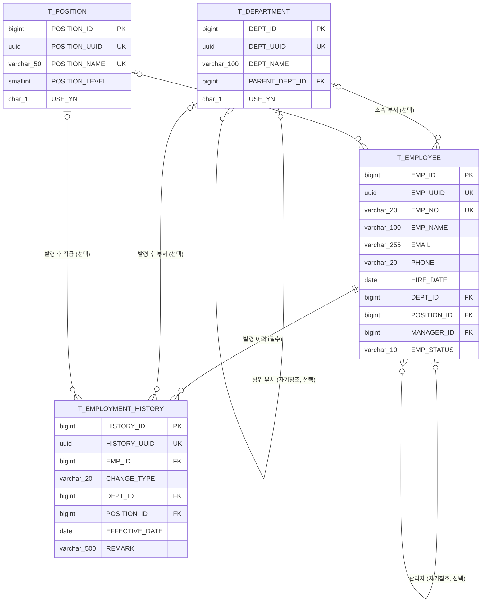

# 직원관리 시스템 ERD

> 이 ERD는 `docs/specs/2026-07-08-employee-management-spec.md` §1 데이터 모델과 `ddl/`의 스키마를 기준으로, 구현에 착수하기 전에 데이터 구조를 정리한 설계 문서다. 부서/직급/직원/인사발령 이력 4개 테이블의 관계와 제약 조건을 여기서 확정한 뒤, 이 구조를 그대로 `ddl/`에 반영하고 애플리케이션(`app/`)이 리플렉션으로 읽어 쓰도록 구현했다.

## ER 다이어그램

모든 테이블은 위 컬럼 외에 공통 감사 컬럼 4개(`CREATED_ON`/`CREATED_BY`/`UPDATED_ON`/`UPDATED_BY`)를 갖는다(`F_AUDIT_LOG` 트리거가 `_ON`을 채움, `_BY`는 이 프로젝트에 인증 컨텍스트가 없어 NULL 유지 — 로그인 확장 이후에도 감사 컬럼 주입은 범위 밖으로 남겨둠, `docs/plans/2026-07-12-employee-login-auth-plan.md` 참고).

## 관계 설명

| 관계 | 종류 | 의미 |
|---|---|---|
| `T_DEPARTMENT.PARENT_DEPT_ID` → `T_DEPARTMENT.DEPT_ID` | 자기참조(1:N) | 부서 조직 계층(상위 부서). 이번 과제 화면에서는 계층 트리 UI까지는 쓰지 않고 평면 목록으로만 사용 |
| `T_EMPLOYEE.DEPT_ID` → `T_DEPARTMENT.DEPT_ID` | N:1 | 직원의 소속 부서 (선택) |
| `T_EMPLOYEE.POSITION_ID` → `T_POSITION.POSITION_ID` | N:1 | 직원의 직급 (선택) |
| `T_EMPLOYEE.MANAGER_ID` → `T_EMPLOYEE.EMP_ID` | 자기참조 N:1 | 직속 상사. 순환 참조·퇴직자 지정은 애플리케이션 레벨에서 차단(`app/services/employee_service.py`) |
| `T_EMPLOYMENT_HISTORY.EMP_ID` → `T_EMPLOYEE.EMP_ID` | N:1 | 이력이 속한 직원 |
| `T_EMPLOYMENT_HISTORY.DEPT_ID`/`POSITION_ID` → `T_DEPARTMENT`/`T_POSITION` | N:1 | 발령 시점의 부서/직급 스냅샷(현재 값이 아니라 그 발령 건 기준 값) |

## 필드 검증 규칙 대응 (스펙 §4 + 별도 확장)

| 필드 | DDL 제약 | 애플리케이션 검증 (`app/schemas/employee.py`) |
|---|---|---|
| `EMP_NO` | `varchar(20)`, `UNQ_T_EMPLOYEE_EMP_NO` | 스펙: 필수·최대20자·고유. **별도 확장**: `^1\d{3}$`(1로 시작하는 숫자 4자리)로 스펙보다 엄격하게 제한 |
| `PHONE` | `varchar(20)` | 스펙: 선택·최대20자. **별도 확장**: 하이픈 없는 숫자 9~11자리 |
| `EMAIL` | `varchar(255)` | 커스텀 정규식(형식 오류 시 한글 메시지) |
| `EMP_STATUS` | `CK_T_EMPLOYEE_STATUS` (`ACTIVE`/`LEAVE`/`RESIGNED`) | `ALLOWED_TRANSITIONS` 단일 소스로 전이 규칙까지 검증(§2) |
| `MANAGER_ID` | FK만 (순환 참조는 DB로 표현 불가) | 존재 확인 + 자기 자신 금지 + 순환 참조 차단 + 퇴직자 지정 금지 (`docs/internal/2026-07-09-data-integrity-review.md`에서 발견 후 반영) |

## 스코프 메모

- `T_EMPLOYMENT_HISTORY`는 스펙의 **bonus(선택)** 항목이며, DDL 자체는 애초에 `ddl/`에 포함되어 확정되어 있었다 — 이번 구현에서 실제로 이 테이블을 읽고 쓰는 서비스 로직(`app/services/employment_history_service.py`)을 채운 것이 이번 과제의 작업 범위다.
- 로그인 기능(스펙 범위 밖 별도 확장)은 이 ERD에 새 테이블을 추가하지 않는다 — 계정은 `.env`의 단일 하드코딩 값(`ADMIN_USERNAME`/`ADMIN_PASSWORD`)이며 DB에 별도 사용자 테이블을 두지 않았다(`docs/plans/2026-07-12-employee-login-auth-plan.md` 참고).
